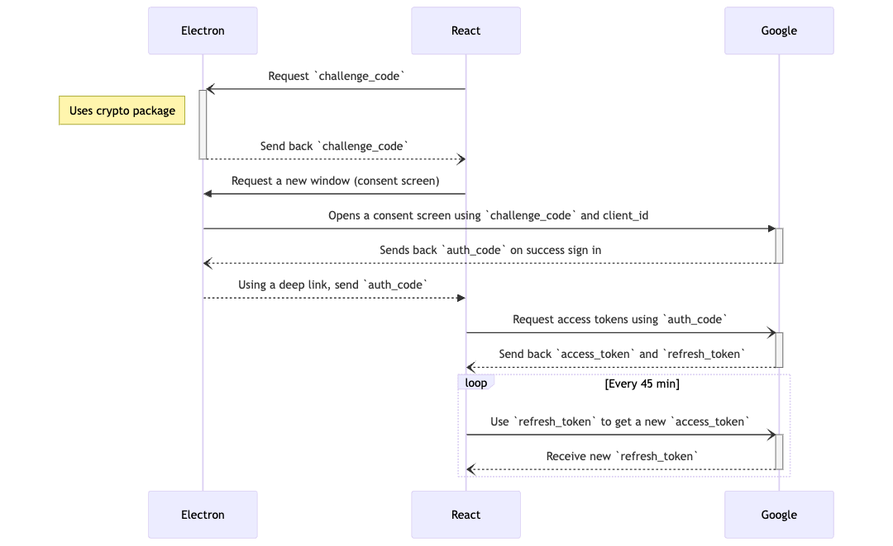

# Authentication

La autenticación en la app _AymurAI_ se utiliza únicamente para el guardado de la información de la spreadsheet en el set de datos. Hay dos opciones:

- [_Google OAuth2_](#google-oauth2)
  (cargando la información en _Google Drive_)
- [_offline local_](#local)
  (escribiendo en el _filesystem_).

Actualmente la autenticación con Google se puede realizar en el paso de guardar documento. Anteriormente, esta opción se seleccionaba en la pantalla de inicio, pero fue removida ya que generaba confusión a los usuarios por dar a entender que la aplicación operaba online cuando en realidad la única instancia en la cual lo puede hacer es a la hora de guardar la spreadsheet de Drive.

Para facilitar el proceso se creó el hook [`useLogin`](../src/hooks/useLogin.ts).

```ts
const { logout, login } = useLogin({
  onLogout: () => ...,
});
```

## Google OAuth2

Utiliza el _social login_ de _Google_ para poder interactuar con la
[_Spreadsheet Google API_](https://developers.google.com/sheets/api/reference/rest).
Esto permite leer/escribir en una hoja de cálculo de _Google Drive_.

El funcionamiento es el siguiente:

1.  Una vez se presiona el botón Google la app de React se comunica con el
    proceso de Node para abrir una nueva ventana que cargaría la _consent screen_.
    El proceso sería:

        1. Se genera un _challenge code_.
        2. Junto al código mencionado se añaden otros datos como el
        `client_id`, `redirect_uri`, etc.
        3. Se genera una URL con los datos anteriores para acceder a
        `'https://accounts.google.com/o/oauth2/...`.
        4. Se abre una nueva ventana con la URL previamente generada.

2.  Una vez abierta la _consent screen_ al comunicarse con el proceso de
    Electron, se añade un _event listener_ para poder tener los datos del usuario y
    guardarlos en la sesión.

3.  Esta comunicación genera un código de autorización que se utiliza para
    obtener el _access token_ y el _refresh token_. Para actualizar el _access token_
    se utiliza el _refresh token_ y un timer cada 45min.

> 💡 Para pasar la información devuelta a la app de _React_ se utiliza un
> [deep link](https://www.electronjs.org/docs/latest/tutorial/launch-app-from-url-in-another-app).
> Suele suceder que en modo _development_ no quede definido el _protocol_ para el
> _deep link_, por lo que se debe usar la versión productiva.



> 💡 [Más información](./excel/spreadsheet-api.md) en cómo se utiliza la
> _Google Spreadsheet API_ para generar los archivos.

## Local

La app simplemente funciona de manera _local_ y _offline_, leyendo/escribiendo
sobre un archivo de datasheet en el filesystem. No requiere ninguna acción extra
por parte del usuario.

Esta opción simplemente inicializa el state de la app con la siguiente
información:

```ts
const loginOffline = (funcType: FunctionType) => {
  setUser({ online: false, function: funcType, token: "" });
  // ...
};
```

> 💡 [Más información](./excel/filesystem.md) en cómo y dónde se genera el
> archivo `.xlsx`.
