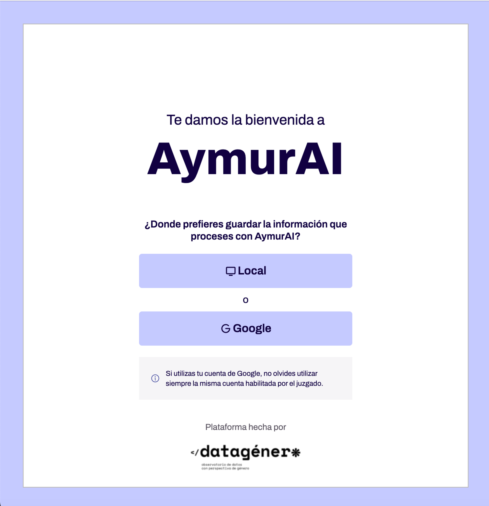

# Authentication

_AymurAI_ funciona con dos opciones para autenticarse: [_Google OAuth2_](#google-oauth2)
(cargando la información en _Google Drive_) y [_offline local_](#local)
(escribiendo en el _filesystem_).

Esta elección se realiza al comenzar el flujo de usuario, seleccionando una de
las siguientes opciones.



Para facilitar el proceso se creó el hook [`useLogin`](../src/hooks/useLogin.ts).

```ts
const { logout, login } = useLogin({
  onLogout: () => ...,
});
```

## Google OAuth2

Utiliza el _social login_ de _Google_ para poder interactuar con la
 [_Spreadsheet Google API_](https://developers.google.com/sheets/api/reference/rest).
 Esto permite leer/escribir en una hoja de cálculo de _Google Drive_.

El funcionamiento es el siguiente:

1. Una vez se presiona el botón Google la app de React se comunica con el
proceso de Node para abrir una nueva ventana que cargaría la _consent screen_.
El proceso sería:

    1. Se genera un _challenge code_.
    2. Junto al código mencionado se añaden otros datos como el
    `client_id`, `redirect_uri`, etc.
    3. Se genera una URL con los datos anteriores para acceder a
    `'https://accounts.google.com/o/oauth2/...`.
    4. Se abre una nueva ventana con la URL previamente generada.

2. Una vez abierta la _consent screen_ al comunicarse con el proceso de
Electron, se añade un _event listener_ para poder tener los datos del usuario y
guardarlos en la sesión.

3. Esta comunicación genera un código de autorización que se utiliza para
obtener el _access token_ y el _refresh token_. Para actualizar el _access token_
se utiliza el _refresh token_ y un timer cada 45min.

> 💡 Para pasar la información devuelta a la app de _React_ se utiliza un
[deep link](https://www.electronjs.org/docs/latest/tutorial/launch-app-from-url-in-another-app).
Suele suceder que en modo _development_ no quede definido el _protocol_ para el
_deep link_, por lo que se debe usar la versión productiva.


> 💡 [Más información](./excel/spreadsheet-api.md) en cómo se utiliza la
_Google Spreadsheet API_ para generar los archivos.

## Local

La app simplemente funciona de manera _local_ y _offline_, leyendo/escribiendo
sobre un archivo de datasheet en el filesystem. No requiere ninguna acción extra
por parte del usuario.

Esta opción simplemente inicializa el state de la app con la siguiente
información:

```ts
const loginOffline = (funcType: FunctionType) => {
  setUser({ online: false, function: funcType, token: "" });
  // ...
};
```

> 💡 [Más información](./excel/filesystem.md) en cómo y dónde se genera el
archivo `.xlsx`.
