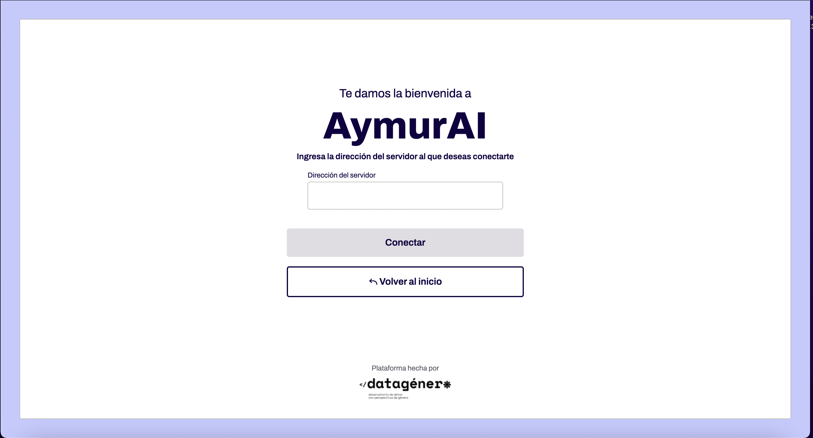

# URL Selector

En la pantalla de inicio el usuario puede elegir cómo desea conectarse a la API de AyMurAI. Hay dos opciones:

- De manera local: esto significa, levantando Docker localmente ya sea de forma manual o utilizando el ejecutable desarrollado por el equipo de Collective AI para levantar la API utilizando **[Miniconda](https://docs.anaconda.com/miniconda/)**.

La aplicación incluye el archivo run_server.bat que, en conjunto con el instalador desarrollado por Collective, procura levantar el server local de modo automático. El funcionamiento de esta feature está condicionada a que el usuario efectivamente tenga el directorio de Miniconda en su PC y esté utilizando Windows. En caso de que dicha ejecución falle, se muestra una alerta al usuario que le indica que deberá hacerlo de forma manual.

- A través de un servidor: los distintos juzgados pueden tener servidores propios a las que se accede a través de su URL.

  Por razones de seguridad, no es conveniente que estas URLs estén en el código de la aplicación, por lo cual el usuario deberá ingrearlas manualmente.

  A fin de mejorar la experiencia de uso, la URL se preserva y autocompleta evitando así que el usuario tenga que reingresarla cada vez que inicia la aplicación.

| Pantalla inicial                                 | Selector                                   |
| ------------------------------------------------ | ------------------------------------------ |
|  |  |
