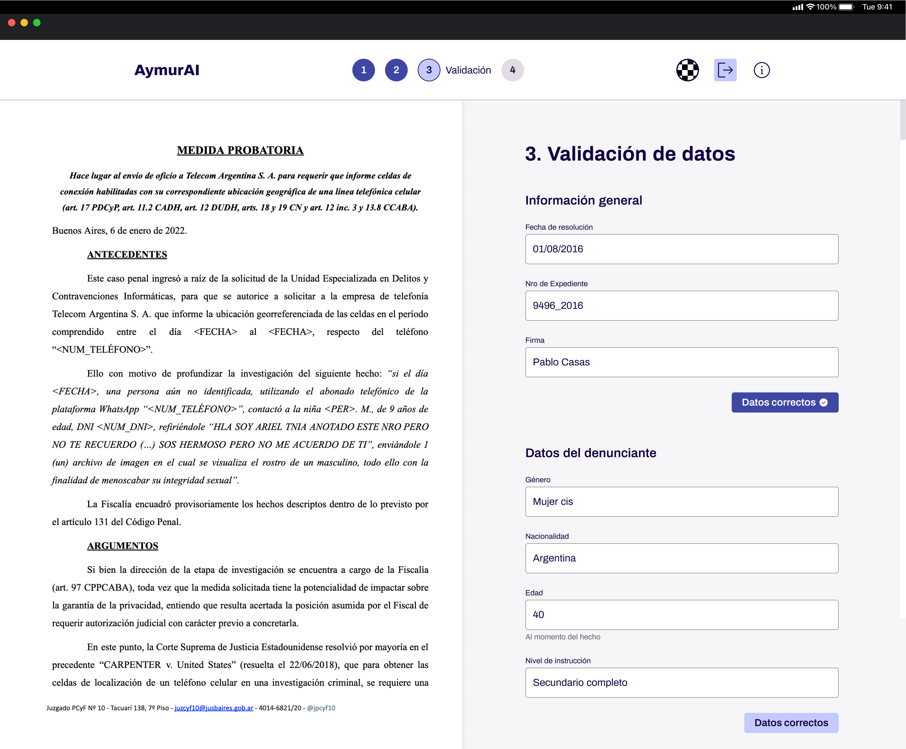
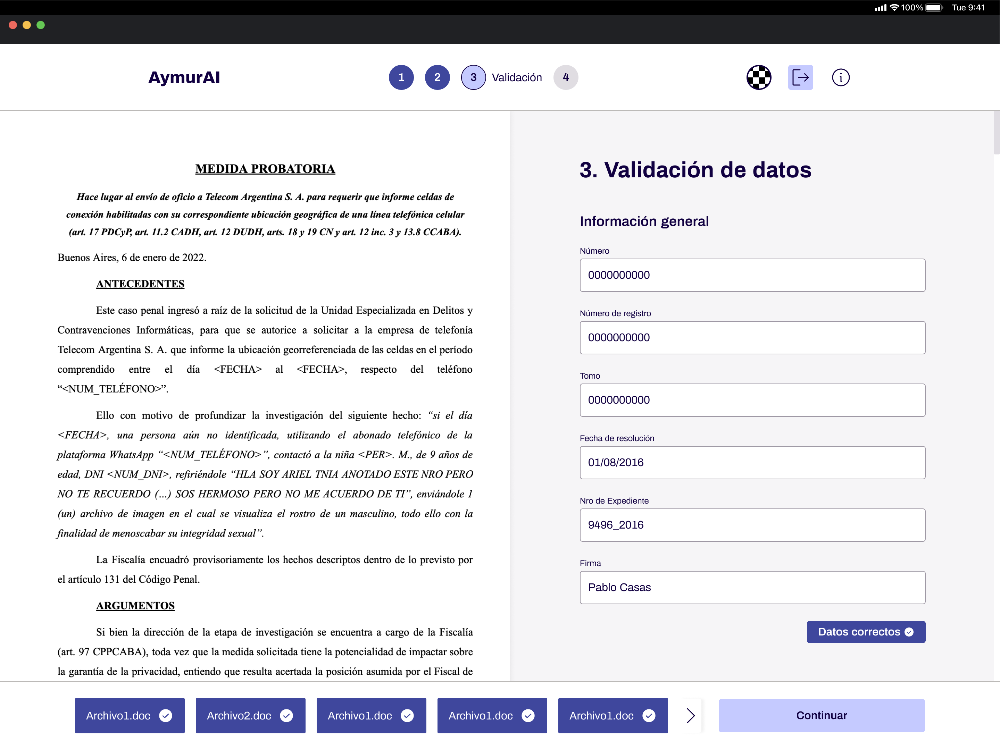

# Validación

El proceso de guardar la información analizada por la AI tiene que ser validado
por un usuario para asegurar que la información es correcta. La validación se
realiza medianete un formulario en el cual se carga la información que devuelve
la API y el usuario puede modificarla si es necesario.



Se desarrollaron varias herramientas para hacer más fácil la generación de las
distintas partes de la pantalla de validación. Entre ellas está el hook
`useForm` y el componente de formulario `<ValidationForm>`.

## Hook `useForm`

Este hook ofrece dos funciones útiles para generar formularios:

- `submit`: una función que se encarga de recolectar toda la información de los
campos del formulario para poder utilizarla a conveniencia del desarrollador.

  ```tsx
  // Ejemplo de uso
  const { submit } = useForm();
  const handler = submit(data => ...)

  return <form onSubmit={handler}></form>
  ```

- `register`: función que permite agregar campos al "state" (más bien una
lista de referencias a los `<input />`) para luego ser recolectados por el
`submit`. Acepta un `string` que representa el "id" del campo.
  
    ```tsx
    // Ejemplo de uso
    const { register } = useForm();
  
    return <input ref={register("ID_CAMPO")} />
    ```

> 💡 Más información sobre cómo están compuestas y se utilizan estas funciones en
el archivo del [hook useForm](../../src/hooks/useForm/index.ts)

## Componente `<ValidationForm>`

La pantalla de validación se constituye por varios `<form>` encapsulados por el
componente `<ValidationForm>` para "estandarizar" su comportamiento.
Simplemente se encarga de envolver los campos (a los cuales se les pasa un
handler `onChange` para detectar cuando se ingresa algún valor) y de agregar un
botón de submit.

> ⚠️ El botón de submit NO envía toda la pantalla, si no que valida el grupo de
campos individual. Para enviar TODA la información (o pasar a la siguiente
resolución) se debe usar el botón del footer.


